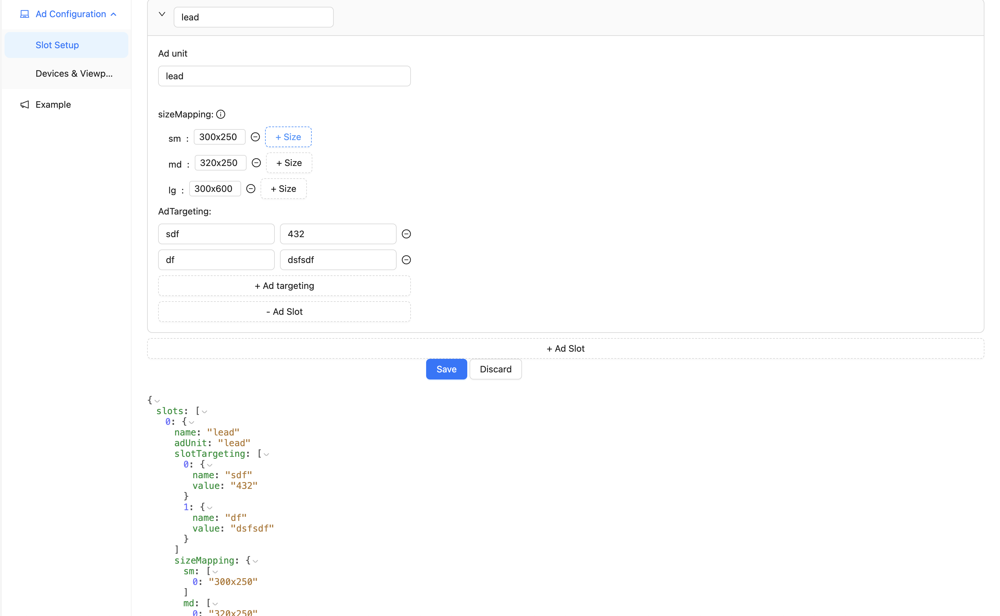
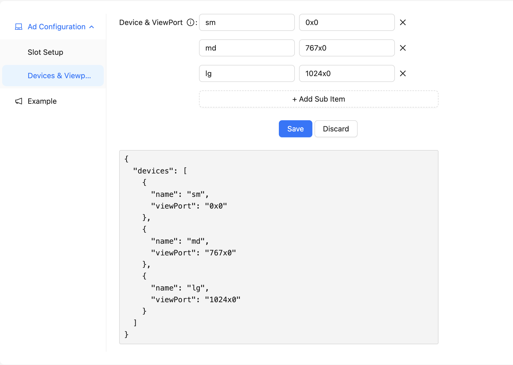
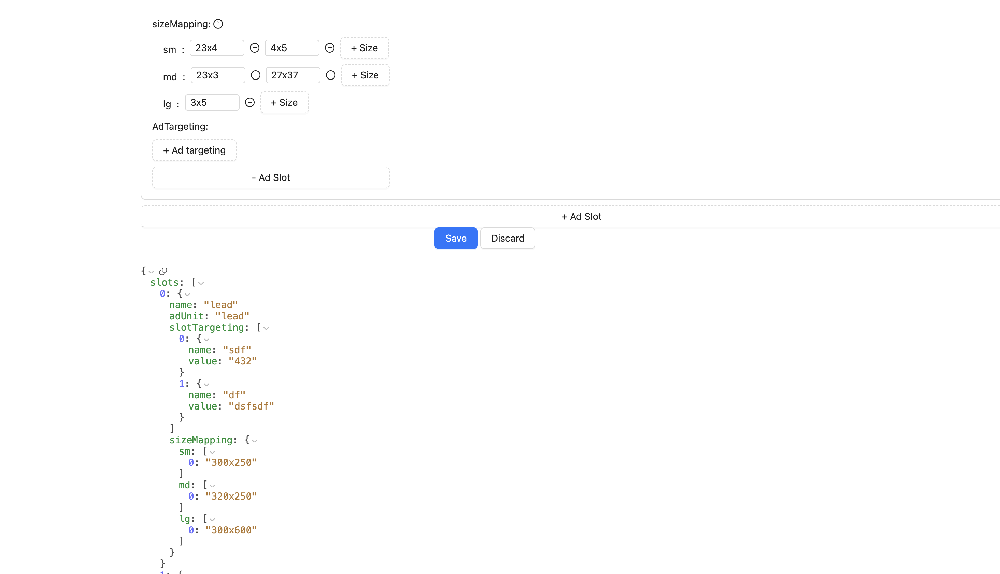

#### About
This is a simple Google ad component(for Google ad tag), that can easily manage responsive Google ads for react(next.js) related system.

You can customize your Ad-slot-related configuration using a web UI.



After configuration, you only need to import the Ad components accordingly. like this.
```js
<Ad id="lead" position="lead" adUnit=“/xxxxxx/Homepage"/>
```

#### How to use
Step 1: 
Create device view port



Step 2： 
Config slots


Step 3：
Copy [Ad components](app%2Fcomponents%2FAd) to your project.

Step 4：

Copy the config data to replace [slotsConfig.js](app%2Fcomponents%2FAd%2FslotsConfig.js) in your project.



Step 5：
Import the Ad components accordingly. like this.
```js
<Ad id="lead" position="lead" adUnit=“/xxxxxx/Homepage"/>
```